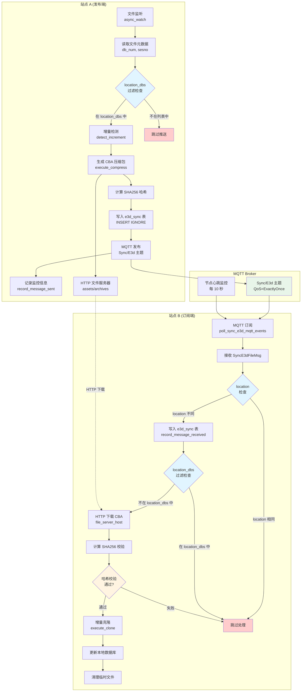
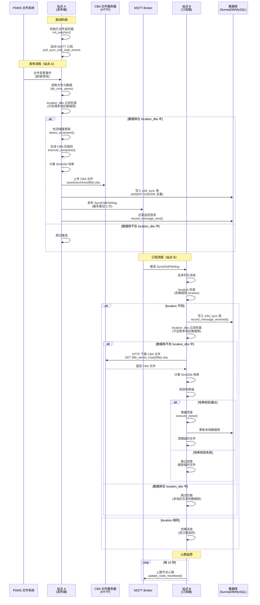

# 异地协同运行原理

## 整体架构流程图



### 架构说明

**核心流程**：
1. **发布端（站点 A）**：
   - 监听 PDMS 文件变化，读取数据库编号（db_num）
   - 通过 `location_dbs` 过滤：只处理本地区负责的数据库
   - 检测增量更新，生成 CBA 压缩包并计算哈希
   - 通过 MQTT 发布同步消息，同时将 CBA 文件存储在 HTTP 文件服务器

2. **MQTT Broker**：
   - 作为消息中间件，负责消息路由和分发
   - 支持 QoS=ExactlyOnce 保证消息可靠传输
   - 维护节点心跳监控，确保连接状态

3. **订阅端（站点 B）**：
   - 订阅 MQTT 主题接收同步消息
   - 过滤相同 location 的消息（避免处理自己推送的消息）
   - 通过 `location_dbs` 过滤：不拉取本地区负责的数据库
   - 从 HTTP 文件服务器下载 CBA 文件并校验哈希
   - 执行增量克隆，更新本地数据库

**关键过滤点**：
- 🔵 **蓝色节点**：`location_dbs` 过滤检查点，确保地区分工
- 🟡 **黄色节点**：哈希校验点，确保文件完整性
- 🔴 **红色节点**：跳过处理节点，避免重复或无效操作

## 时序流程图



### 时序说明

**关键步骤**：

1. **启动阶段**：
   - 站点 A 初始化文件监听器，扫描并缓存所有数据库文件
   - 站点 B 启动 MQTT 订阅，连接 Broker 并开始监听

2. **发布流程**：
   - 文件变更触发增量检测
   - `location_dbs` 过滤确保只推送本地区负责的数据库
   - 生成 CBA 文件并上传到 HTTP 服务器
   - 通过 MQTT 发布同步消息，记录到数据库用于去重

3. **订阅流程**：
   - 接收 MQTT 消息，过滤相同 location（避免处理自己推送的）
   - `location_dbs` 过滤确保不拉取本地区负责的数据库
   - 从 HTTP 服务器下载 CBA 文件并校验哈希
   - 执行增量克隆，更新本地数据库

4. **心跳监控**：
   - 订阅端每 10 秒上报心跳，确保连接状态可监控

## 核心组件
- **运行态**：`src/web_server/remote_runtime.rs` 在启动时同时拉起 PDMS 文件监听 (`async_watch`) 和 MQTT 订阅 (`poll_sync_e3d_mqtt_events_with_backoff`)。
- **MQTT 侧**：`src/mqtt_service/mod.rs` 定义 `SyncE3dFileMsg` 负载（文件名、文件哈希、文件服务器地址、来源站点、会话区间、统计信息等），使用 rumqttc QoS=ExactlyOnce。
- **监控/控制**：`src/web_server/mqtt_monitor_handlers.rs` 维护节点心跳、消息投递状态，暴露 `/api/mqtt/*` 查询；`DbOption.toml` 提供 `mqtt_host/mqtt_port/location/project_code/file_server_host/location_dbs` 等配置；`remote_sync_envs` 表提供订阅重连退避参数。

## 发布流程（主站）
1. **监听文件**：`AiosDBManager::async_watch` 发现新增/变更的 DB 文件，读取头部元数据（db_num、sesno 等），可按 `location_dbs` 过滤负责范围。
2. **打包与校验**：`execute_compress` 生成 `{file}.cba` 到 `assets/archives`，计算 SHA256 作为 `file_hash`，若失败写入 `FailedTaskQueue` 等待重试。
3. **记录与去重**：将 `SyncE3dFileMsg` 写入 MySQL `e3d_sync`（`INSERT IGNORE`），用于后续去重/追踪。
4. **投递 MQTT**：`publish_sync_payload_with_retry` 向 `Sync/E3d` 主题发布，最多重试 3 次；成功后通过 `record_message_sent` 记入监控表，包含来源站点、文件数量、预期接收方（目前为空）。

## 订阅流程（从站或其他节点）
1. **启动订阅**：`poll_sync_e3d_mqtt_events_with_backoff` 以 `location-project_code-sub` 为 client id 连接 Broker，订阅 `Sync/E3d`，每 10 秒通过 `update_node_heartbeat` 上报在线状态。
2. **消息处理**：收到 Publish 后反序列化 `SyncE3dFileMsg`；若 `location` 与本地相同则忽略，否则写入 `e3d_sync` 并 `record_message_received` 计数。
3. **拉取与校验**：按 `file_server_host/{file}.cba` 通过 HTTP 下载到本地临时目录，计算 SHA256。若与 `file_hashes` 对应项不一致则跳过克隆并删除临时文件；缺少哈希时仅记录日志后继续。
4. **增量应用**：对未命中的本地 db_no 且路径映射存在的文件，使用 `CloneOptions::new_local` + `execute_clone` 将临时 CBA 增量克隆到目标路径，完成后清理临时文件；成功后将订阅 backoff 重置，错误则进入指数退避重连。
5. **重连策略**：初始/最大退避由 `remote_sync_envs` 配置，连接/订阅失败会将 `MQTT_CONNECT_STATUS` 置为 false，退出内层循环后按退避等待再重连。

## 地区分工与数据库过滤机制（location_dbs）

`location_dbs` 配置项实现了**地区分工机制**，通过双向过滤确保每个站点只负责特定数据库的推送，并接收其他站点负责的数据库更新。这是一个关键的约束机制，用于避免跨地区重复推送和拉取。

### 配置说明

在 `DbOption.toml` 中配置：
```toml
# 本地区负责的数据库编号列表
location_dbs = [1112]

# 如果注释掉或设为空，则所有数据库都会被推送，且不会跳过任何拉取
# location_dbs = []
```

### 推送约束（发布端）

**作用**：只推送本地区负责的数据库编号对应的增量更新。

**实现位置**：
- `src/data_interface/increment_manager.rs:588-599` - 新文件检测时的过滤
- `src/data_interface/increment_manager.rs:1335-1342` - 批量推送时的过滤

**过滤逻辑**：
```rust
// 如果配置了 location_dbs，则只对本地区负责的 dbnum 发送通知
if let Some(location_dbs) = &get_db_option().location_dbs {
    if !location_dbs.contains(&dbno) {
        // 跳过推送，返回空结果
        return Some(NewFileResult { ... });
    }
}
```

**行为**：
- ✅ 如果数据库编号在 `location_dbs` 列表中，正常推送增量更新
- ❌ 如果数据库编号不在列表中，跳过推送（不生成 CBA，不发送 MQTT 消息）

### 拉取约束（订阅端）

**作用**：不拉取本地区负责的数据库的远程更新（避免重复处理）。

**实现位置**：
- `src/data_interface/db_model.rs:127-137` - 远程克隆时的过滤

**过滤逻辑**：
```rust
// 必须不是当前区域的db才能clone，只能clone别的区域的数据
if let Some(dbno) = watcher.get_dbno(&pb) {
    // 跳过当前区域的dbnos
    if let Some(dbs) = loc_dbs {
        if dbs.contains(&dbno) {
            continue;  // 跳过克隆
        }
    }
}
```

**行为**：
- ✅ 如果数据库编号不在 `location_dbs` 列表中，正常拉取并克隆
- ❌ 如果数据库编号在列表中，跳过拉取（因为这是本地区负责的，应该由本地区推送）

### 配置示例

**场景：多站点分工**

假设有三个站点：
- **站点 A（北京）**：负责数据库 `[1112, 1113]`
- **站点 B（上海）**：负责数据库 `[2001, 2002]`
- **站点 C（广州）**：负责数据库 `[3001, 3002]`

**站点 A 的配置**：
```toml
location = "bj"
location_dbs = [1112, 1113]
```

**行为**：
- ✅ 站点 A 只推送数据库 `1112` 和 `1113` 的增量更新
- ✅ 站点 A 会拉取站点 B 和站点 C 推送的数据库 `2001, 2002, 3001, 3002` 的更新
- ❌ 站点 A 不会拉取其他站点推送的 `1112` 和 `1113` 的更新（因为这是自己负责的）

### 配置行为总结

| 配置状态 | 推送行为 | 拉取行为 |
|---------|---------|---------|
| `location_dbs = [1112]` | 只推送 1112 | 不拉取 1112，拉取其他 |
| `location_dbs = []` | 推送所有数据库 | 拉取所有数据库（可能重复） |
| `location_dbs` 注释掉 | 推送所有数据库 | 拉取所有数据库（可能重复） |

### 注意事项

1. **避免重复处理**：`location_dbs` 的核心目的是避免同一数据库被多个站点重复推送和拉取
2. **配置一致性**：确保不同站点的 `location_dbs` 不重叠，否则会导致某些数据库无人推送
3. **空配置风险**：如果注释掉 `location_dbs`，所有站点都会推送所有数据库，可能导致重复推送和资源浪费
4. **与 `sync_push_db_types` 配合**：`location_dbs` 控制**哪些数据库编号**，`sync_push_db_types` 控制**哪些数据库类型**（如 DESI、CATA 等），两者共同约束推送范围

## 监控与控制
- **服务器管理**：`/api/sync/mqtt/start|stop|status` 控制 rumqttd 进程（需要外部安装）；`/api/mqtt/subscription/start|stop|status` 控制订阅任务运行态。
- **可视化**：`/api/mqtt/nodes`, `/api/mqtt/messages`, `/api/mqtt/messages/:id` 提供前端监控数据（节点心跳、消息收发、投递状态）。

## 已知遗留与风险
- **心跳任务泄漏风险**：订阅重连时每次都会 `tokio::spawn` 新的心跳循环，旧任务未取消，长时间断开-重连可能累积后台任务。
- **哈希缺失路径**：当 `SyncE3dFileMsg` 未携带 `file_hashes` 时仍然执行克隆，无法保障完整性；发送侧需确保始终携带哈希或在缺失时拒收。
- **下载/校验方式**：当前一次性读取整份 CBA 到内存计算 SHA256，大文件会占用大量内存；建议改为流式下载+哈希，并考虑断点/带宽限制。
- **路径回退与越界**：找不到文件映射时使用硬编码回退路径（SJZ 示例目录），容易导致写入错误位置或失败，应改为显式报错并中止。
- **安全性**：HTTP 拉取 CBA 未做认证/HTTPS 校验，MQTT 也缺少用户名/密码配置，易受中间人或伪造消息攻击。
- **幂等性与跟踪**：`e3d_sync` 去重依赖数据库约束且操作 `unwrap`，失败会 panic；克隆结果（成功/失败）未回写到监控或表中，发送端也没有 ACK 机制。
- **资源清理**：临时目录按文件删除但未定期清空；长时间运行可能残留空目录或失败文件。

## 建议的后续工作
- 在订阅重连前清理或复用心跳任务；同时在 ConnAck 时将 `MQTT_CONNECT_STATUS` 置为 true 便于 UI 感知。
- 发送端强制填充 `file_hashes`，订阅端在缺失哈希时直接拒绝并记录失败事件。
- 将下载与哈希改为流式处理，并为 HTTP 拉取添加认证/HTTPS 校验；MQTT 增加用户名/密码/TLS。
- 当路径映射缺失时终止处理并明确告警，移除硬编码回退路径。
- 记录克隆结果到监控（含失败原因），并为 `e3d_sync` 增加显式唯一键/状态字段，建立 ACK/重试闭环。
- 定期清理临时目录与监控内存表（超过 1000 条等）以避免资源膨胀。
